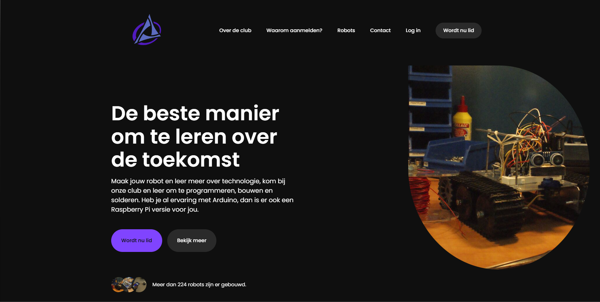

<p align="center">
  
</p>

<h1 align="center">Robotica Werenfridus v.6</h1>

<p align="center">
  🚀 Code for people to explore and see what we as students of this club are capable of, <strong>because of the club.</strong><br>
  🌐 <a href="https://roboticawerenfridus.nl" target="_blank">roboticawerenfridus.nl</a>
</p>

---

## ℹ️ About this website

**rw-v6** is the sixth iteration of the robotics website, this time completely changed for the next era of this club. 
Next school years we will be trying to expand our community, to become a loved club at school, even for the haters.
This site is written by 2 club members, more about them on the site itself (me too ofc).
The backend dev for this site is <a href="https://github.com/NathanSchalkwijk">@NathanSchalkwijk</a>, he worked on the login, registering, router.php etc. 
We have worked on many other sites before, tried React (found it meh), website builders (not really website "building") and much more, until we decided to go for plain old buddy HTML.
I made the frontend first, and then handed it off to <a href="https://github.com/NathanSchalkwijk">@NathanSchalkwijk</a> to work on the backend, he was also the one who decided to use PHP.
But why, well thats because:

- Less buggy, hosting anywhere, including local in the code editor.
- HTML is really easy
- No building or deploying, just hosting.
- CSS and JS with HTML can be in just a .HTML file.
- PHP works well for databases, hosting and navigation.





---

## 🔧 How does the website work. How is it built?

So for this one we added a "Robotica Lid" dashboard. 
It allows users who become members to experience something special with they're own dashboard, accessing the docs, newest newsletters and scheduling there visits to the club.
How the website actually works is different.

* HTML, JS and CSS stack
* Added PHP for better backend on login etc.
* Run using PHP
* Hosted on Printiacs Hosting, with their attack protection and custom built proxy system.
 ------
* To host it yourself,
* make sure your have a sessions folder in the root directory of the site
* run the site using "php -S <host>:<port> router.php" eg. php -S 0.0.0.0:5000 router.php
* the router.php is used for the site's navigation, it's not essential but it makes the URLs look nicer because it allows for the .php file extension to not be in the requested URL.
* router.php also makes the 404.php and 403.php work, so if you want those you need it.
---

## 🌐 Language

Ben jij Nederlands en wil je deze README bekijken? Klik dan <a href="https://roboticawerenfridus.nl" target="_blank">hier</a> om de NL versie te bekijken!

---

## 🍴 Want to make your own version of the website?

Go for it, download the repo now and fork it. You can submit it via email or IRL and maybe your website version will turn into the v7 of the site!
```bash
# Clone the repo
git clone https://github.com/wolfspace099/rw-v6

# Cd into the folder
cd rw-v6

# Install PHP and it's dependencies
sudo apt install php

# Create the two databases on an sql server
CREATE DATABASE IF NOT EXISTS website;
USE website;

CREATE TABLE members (
    id INT(11) NOT NULL AUTO_INCREMENT,
    name VARCHAR(150) NOT NULL,
    student_number VARCHAR(7),
    email VARCHAR(150) NOT NULL,
    parent_contact VARCHAR(150),
    password VARCHAR(255) NOT NULL,
    level VARCHAR(50),
    invoice_agreement TINYINT(1) DEFAULT 0,
    created_at TIMESTAMP DEFAULT CURRENT_TIMESTAMP,
    admin TINYINT(1) DEFAULT 0,
    PRIMARY KEY (id)
);

# Database 2
CREATE DATABASE IF NOT EXISTS newsletter;
USE newsletter;

CREATE TABLE subscribers (
    id INT(11) NOT NULL AUTO_INCREMENT,
    email VARCHAR(120) NOT NULL,
    PRIMARY KEY (id)
);


# Fill in the two xml files needed for the newsletter and users
sudo nano sqlconfig.xml #config 1 is for the users
sudo nano sqlconfig2.xml #config 2 is for the newsletter

# Make the sessions folder
mkdir sessions

# Run the php server
php -S 0.0.0.0:5000 router.php
```

Change the repo how you want, its open to changes with the license.
